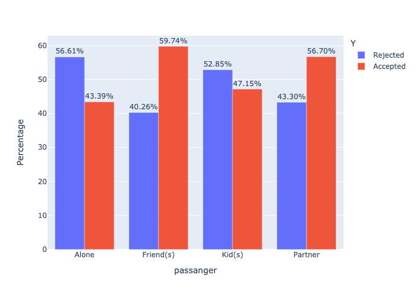

# Will the Customer Accept the Coupon?

This project explores customer behavior in accepting driving coupons by leveraging visualizations and probability distributions.

[Data File](data/coupons.csv)

## Prerequisites

**Jupyter Notebook**
- Anaconda-Navigator Jupyter Notebook
- Any IDE supporting Jupyter Notebook

**Python Version**
- 3.11.5

**Key Libraries**
- matplotlib (3.7.2)
- seaborn (0.12.2)
- pandas (2.0.3)
- plotly (5.9.0)

## Exploratory Analysis in Jupyter Notebook

Comprehensive observations and analyses are documented in the [Jupyter Notebook](./prompt.ipynb), complete with visualizations and explanatory comments.

## Data Handling

- **Initial Dataset**: Comprises `12684` entries.
- **Columns with Missing Data**:

```
========================================
Column             % of missing data
========================================
car                     99.15%
Bar                      0.84%
CoffeeHouse              1.71%
CarryAway                1.19%
RestaurantLessThan20     1.02%
Restaurant20To50         1.49%
```

- **Data Cleaning**: The 'car' column, with 99.15% missing data, was dropped. Rows with 1-2% missing data in other columns were also removed, leaving us with `12079` entries.
- **Data Conversion**: Several columns were transformed into categorical data types, both ordered and unordered.

## Detailed Data Analysis

### Key Findings from Initial Observations

1. **Most Popular Coupon**: `Coffee House` stands out as the most favored coupon type.
   
   

2. **Overall Acceptance Rate**: Approximately 56.93% of all coupons were accepted.

    

### In-Depth Analysis of Bar Coupons

#### Acceptance Rates by Demographics and Behaviors

**Bar Visit Frequency**: There's a clear trend that drivers who visit bars more regularly, especially those going more than three times a month, show a significantly higher likelihood of accepting bar coupons.

**Age Influence**: The age of drivers plays a crucial role. Those aged over 25, particularly if they are regular bar-goers, are more inclined to accept coupons, hinting at a preference for social outings among this more mature age group.

**Family Dynamics**: The family status of drivers, especially those without kid passengers and who are not widowed, correlates with a higher acceptance of bar coupons. This trend might reflect how certain lifestyle choices impact openness to leisure offers.

**Financial and Dining Choices**: A noticeable pattern is that individuals often dining at budget-friendly restaurants and earning below $50K are less inclined to accept bar coupons, with a 45.65% acceptance rate. This could point to distinct priorities or financial considerations shaping their engagement with such promotions.

#### Summary

Overall, these insights reveal that drivers who are socially active, of a certain age, and with specific family backgrounds are more receptive to bar coupons. This understanding could be instrumental in devising more effective marketing strategies or in comprehending consumer behavior related to leisure and promotional activities.


#### Actionable Insights and Recommendations

1. **Target Socially Active Drivers**: Focus on drivers who frequently visit bars, as they are more likely to accept bar coupons.

2. **Focus on Mature Age Groups**: Given the higher acceptance rate among drivers over 25, tailor marketing strategies towards this demographic.

3. **Consider Family Status in Marketing**: Drivers without kid passengers and who are not widowed show a higher propensity for coupon acceptance, indicating a potential target group.

4. **Adjust Offers for Financial and Dining Preferences**: Tailor offers to resonate with individuals who frequent budget-friendly dining options and have lower income levels.

### In-Depth Analysis of Coffee House Coupons

1. I have generated bar plots for all categorical variables in relation to coupon acceptance (denoted by the 'Y' column) to identify which factors influence coupon acceptance. These visualizations were instrumental in determining the variables most impactful in coupon acceptance, leading me to focus further analysis on the following columns: `destination`, `passanger`, `expiration`, `age`, `occupation`, and `CoffeeHouse`.

    

2. The observed acceptance rates for the selected columns are as follows:

   - `destination`: Acceptance rate of 57.82%
   - `passanger`: Acceptance rate of 59.14%
   - `expiration`: Acceptance rate of 58.06%
   - `age`: Acceptance rate of 52.86%
   - `occupation`: Acceptance rate of 57.31%
   - `CoffeeHouse`: Acceptance rate of 65.90%

3. Bar plots were generated for the columns `destination`, `passanger`, `expiration`, `age`, and `CoffeeHouse`, showcasing the percentages of accepted and rejected coupons. The following are the respective bar plots:

    <div style="display: flex; justify-content: space-between;">
        
        
    </div>
    <div style="display: flex; justify-content: space-between;">
        
        
    </div>
    <div style="text-align: center;">
        
    </div>

4. Based on the aforementioned plots, the following columns and their specific values have been identified as key factors that potentially enhance the acceptance of coffee house coupons:

   - Drivers who visit `coffeeHouses` at least once a month.
   - Drivers under the age of 30.
   - Passengers who are either `friends` or a `Partner`.
   - Drivers who are either `students` or `unemployed`.
   - Coupons with an expiration of one day, as opposed to just a few hours.
   - A `destination` specified as `No Urgent Place`.

5. For more in-depth analysis, I have refined the coffee house dataset to exclusively include drivers who frequent `coffeeHouses` at least once monthly.

#### Acceptance Rates by Demographics and Behaviors

- **Younger Age Groups and Social Settings**: Higher acceptance rates were noted among younger age groups (below 21 to 26) when accompanied by friends or partners.

- **Student and Unemployment Status**: A significant acceptance rate was observed among students and unemployed individuals, particularly in younger age brackets.

- **Expiration Influence**: Coupons with a one-day expiration period showed a higher acceptance rate.

**Trivia:** When the driver is a student under 21 years of age and the coupon has a one-day expiration, the likelihood of a `Coffee House` coupon being accepted increases significantly, with a 95.45% probability of acceptance..

#### Actionable Insights and Recommendations

1. **Target Young, Social Customers**: Focus marketing efforts on younger demographics, particularly those under 30, who exhibit a higher likelihood of coupon acceptance in social settings.

2. **Emphasize Longer Expiration Periods**: Offering coupons with a one-day expiration can significantly increase acceptance rates.

3. **Engage Students and Unemployed Individuals**: Tailor promotions to attract students and unemployed individuals, as they are more inclined to accept coffee house coupons.


### Summary and Next Steps

This analysis offered insightful information about the dynamics of coupon acceptance, specifically targeting Bar and Coffee House scenarios. When it comes to Bar coupons, a clear preference was observed among individuals over 25 who frequent bars more regularly. This demographic could be a key target for specialized bar promotions or loyalty programs.

On the other hand, Coffee House coupons resonated more with the younger crowd, especially students and those without steady employment. The appeal here seems to hinge on social activities and a flexible timeframe for coupon use.

Looking ahead, a strategic approach should be centered on these identified preferences. For bars, crafting offers that cater to the regular, older clientele could prove beneficial. In contrast, coffee house promotions might see better engagement by focusing on younger audiences, perhaps through social media campaigns or partnerships with educational institutions. Additionally, diving into predictive analytics could refine our understanding and enhance the effectiveness of future marketing efforts.
